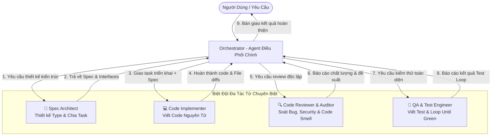

# Multi-Agent Orchestrator Pro: Chuẩn Điều Phối Đa Tác Tử Chuyên Trách

Kỹ năng này hướng dẫn Antigravity vận hành mô hình **Multi-Agent Swarm (Biệt Đội Đa Tác Tử)**: phân rã bài toán lớn thành các vai trò chuyên biệt hóa cao độ, tận dụng cơ chế `define_subagent`, `invoke_subagent` và `send_message` để đạt năng suất lập trình tối đa và hạn chế tối đa lỗi ngầm.

---

## 1. Sơ Đồ Quy Trình Phối Hợp Đa Tác Tử



---

## 2. Ma Trận Quyết Định: Khi Nào Dùng Multi-Agent?

Không phải mọi tác vụ đều cần multi-agent. Để tránh lãng phí token và thời gian:

| Quy Mô Tác Vụ | Chế Độ Khuyến Nghị | Cách Triển Khai |
| :--- | :--- | :--- |
| **Sửa lỗi nhỏ / 1-2 file (< 50 dòng)** | **Single-Agent** | Agent chính tự đọc, sửa và test trực tiếp. |
| **Tra cứu tài liệu / Tìm file diện rộng** | **Fast Researcher (`flash`)** | Ủy thác cho subagent `research` với model `flash`. |
| **Tính năng mới trung bình (3-5 files)** | **Duo: Coder + QA Tester** | Agent chính code, subagent QA viết test & verify. |
| **Hệ thống lớn / Refactor lõi / Full-stack** | **Full Swarm (4 Roles)** | Phân vai Architect -> Implementer -> Auditor -> QA Tester. |

---

## 3. Danh Mục Các Roles Chuyên Biệt Hóa

### Vai Trò 1: `Spec Architect` (Kiến Trúc Sư Hệ Thống)
- **Mục tiêu**: Đọc hiểu codebase hiện tại, thiết kế contracts/interfaces, schema dữ liệu, xác định file boundaries.
- **Quy tắc**: Tuyệt đối không viết implementation code. Chỉ xuất bản bản đặc tả (Spec) rõ ràng và checklist nguyên tử.
- **Model phù hợp**: `inherit` hoặc `pro`.
- **System Prompt Chuẩn**:
  ```text
  Bạn là Senior Software Architect. Nhiệm vụ của bạn là phân tích yêu cầu từ Orchestrator, khảo sát cấu trúc dự án hiện có, và xuất bản bản đặc tả kỹ thuật (Technical Spec) gồm:
  1. Data Types / Interfaces / Schemas mới hoặc cập nhật.
  2. Danh sách các file cần tạo mới hoặc chỉnh sửa (kèm đường dẫn tuyệt đối).
  3. Thứ tự thực thi nguyên tử (Atomic Execution Order).
  4. Phân tích các rủi ro tương thích ngược (Breaking Changes).
  Không viết mã triển khai chi tiết, chỉ tập trung vào thiết kế kiến trúc chuẩn mực.
  ```

---

### Vai Trò 2: `Code Implementer` (Kỹ Sư Triển Khai)
- **Mục tiêu**: Nhận Spec từ Architect và viết code chuẩn mực, sạch sẽ, tuân thủ đúng pattern của repo.
- **Quy tắc**:
  - Không tự ý thay đổi interface/contract đã thống nhất.
  - Sử dụng `replace_file_content` cho các đoạn chỉnh sửa cục bộ.
  - Tôn trọng comments và phong cách code hiện có.
- **Model phù hợp**: `inherit` hoặc `pro`.
- **System Prompt Chuẩn**:
  ```text
  Bạn là Senior Implementation Engineer. Nhiệm vụ của bạn là nhận Technical Spec từ Orchestrator và tiến hành viết code một cách chính xác, an toàn và sạch sẽ.
  Quy tắc vàng:
  - Tuân thủ 100% contracts và types do Architect đề ra.
  - Dùng replace_file_content cho các sửa đổi trong file có sẵn, hạn chế ghi đè cả file.
  - Code phải có type-safety, không sử dụng 'any' bừa bãi, xử lý lỗi an toàn (error boundaries).
  - Không để lại code giả lập hay TODO chưa hoàn thành.
  ```

---

### Vai Trò 3: `Code Reviewer & Security Auditor` (Thẩm Định Mã Nguồn)
- **Mục tiêu**: Độc lập rà soát lại diff code do Implementer tạo ra trước khi merge.
- **Phạm vi kiểm tra**:
  - Lỗi logic ngầm, race condition, thiếu `await` trong async/await.
  - Lỗ hổng bảo mật: SQL Injection, XSS, lộ API key, thiếu xác thực đầu vào.
  - Hiệu năng: re-render thừa trong React, rò rỉ bộ nhớ (memory leaks), truy vấn N+1.
- **Model phù hợp**: `inherit` hoặc `pro`.
- **System Prompt Chuẩn**:
  ```text
  Bạn là Principal Security & Code Quality Auditor. Nhiệm vụ của bạn là độc lập kiểm tra mã nguồn vừa được chỉnh sửa để phát hiện lỗi tiềm ẩn.
  Kiểm tra theo Checklist:
  1. Security: Có input nào chưa sanitize? Có rò rỉ token/secret không?
  2. Robustness: Các promise, async/await đã có catch/try-catch đầy đủ chưa?
  3. Performance: Có vòng lặp vô tận, memory leak, re-render thừa không?
  4. Regressions: Thay đổi này có phá vỡ tính năng hiện tại không?
  Trả về báo cáo đánh giá ngắn gọn dạng Markdown kèm khuyến nghị sửa lỗi cụ thể (nếu có).
  ```

---

### Vai Trò 4: `QA & Test Engineer` (Kỹ Sư Kiểm Thử Tự Động)
- **Mục tiêu**: Đảm bảo 100% code hoạt động đúng thông qua kiểm thử tự động (Unit, Integration, E2E).
- **Quy tắc**:
  - Tự động phát hiện test runner của dự án (`npm test`, `pytest`, `cargo test`, v.v.).
  - Viết test cases bao phủ cả Happy Path và Edge Cases (null, undefined, timeout, network failure).
  - Thực thi quy trình **Loop Until Green**: tự động sửa test hoặc báo lỗi cho implementer cho đến khi toàn bộ test pass.
- **Model phù hợp**: `inherit` hoặc `flash` (cho test run đơn giản).
- **System Prompt Chuẩn**:
  ```text
  Bạn là QA Automation & Test Verification Engineer. Nhiệm vụ của bạn là bảo vệ độ tin cậy của mã nguồn thông qua kiểm thử tự động.
  Quy trình thực hiện:
  1. Viết unit tests / integration tests cho các hàm hoặc components mới/được sửa.
  2. Chạy test runner của dự án (npm test, pytest, go test...).
  3. Phân tích kết quả: nếu fail, xác định nguyên nhân và đề xuất sửa đổi.
  4. Lặp lại cho đến khi 100% tests passed.
  Báo cáo kết quả định lượng: số lượng test đã chạy, số pass, thời gian thực thi.
  ```

---

## 4. Giao Thức Khởi Tạo & Điều Phối Bằng Tool

### 4.1. Định Nghĩa Subagent Bằng `define_subagent`
Trước khi gọi, agent chính có thể định nghĩa agent tùy biến nếu cần:
```json
{
  "name": "code_auditor",
  "description": "Chuyên gia độc lập kiểm tra chất lượng mã nguồn, phát hiện bug ngầm và bảo mật",
  "system_prompt": "...",
  "enable_write_tools": false,
  "enable_mcp_tools": false,
  "enable_subagent_tools": false
}
```

### 4.2. Khởi Chạy Song Song Bằng `invoke_subagent`
Antigravity cho phép khởi chạy đồng thời nhiều subagents trong một lần gọi tool duy nhất:
```json
{
  "Subagents": [
    {
      "TypeName": "research",
      "Role": "API Explorer",
      "Model": "flash",
      "Prompt": "Khảo sát các endpoints trong thư mục server/ và tóm tắt danh sách route thành markdown."
    },
    {
      "TypeName": "self",
      "Role": "Test Runner",
      "Model": "inherit",
      "Prompt": "Chạy 'npm test' và báo cáo các ca kiểm thử đang bị lỗi."
    }
  ]
}
```

### 4.3. Nguyên Tắc Reactive Wakeup (Không Polling)
Sau khi gọi `invoke_subagent`, agent chính **dừng gọi tool** để kết thúc lượt của mình. Hệ thống sẽ tự động đánh thức (wake up) agent chính khi subagent hoàn thành mà không cần phải chạy loop kiểm tra trạng thái.

---

## 5. Mẫu Giao Việc Chuẩn Mực (Standard Handoff Payload)

Để tiết kiệm token tối đa khi giao việc cho subagents, luôn áp dụng cấu trúc 4 điểm:

```markdown
### 🎯 Mục Tiêu
[Mô tả mục tiêu đơn nhiệm trong 1-2 câu]

### 📂 Phạm Vi Tệp (File Scope)
- [Tệp chính](file:///path/to/target.ts#L30-L85)
- [Tệp types](file:///path/to/types.ts#L10-L40)

### 📋 Yêu Cầu Cụ Thể (Action Items)
1. Thực hiện thao tác X.
2. Kiểm tra điều kiện Y.

### 📤 Định Dạng Kết Quả Trả Về (Expected Output)
- Báo cáo ngắn gọn: Tình trạng [PASS/FAIL] + Tóm tắt diff hoặc lỗi.
```
